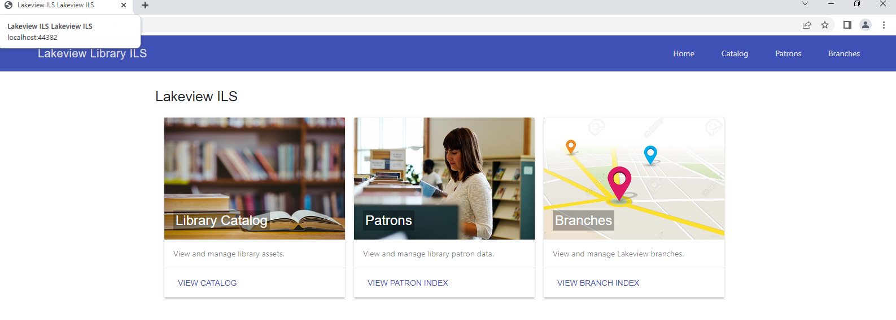
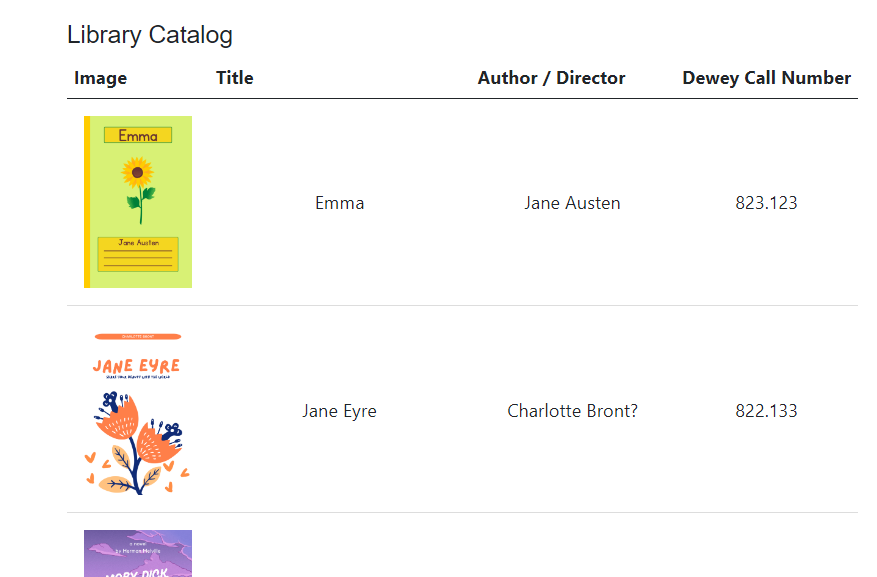
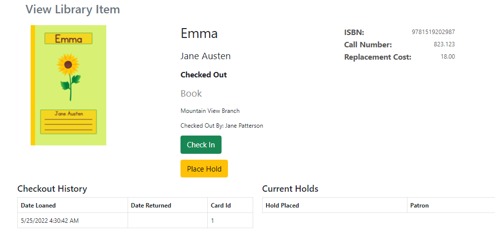
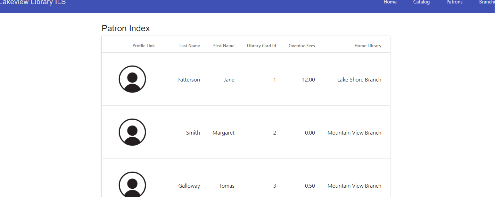
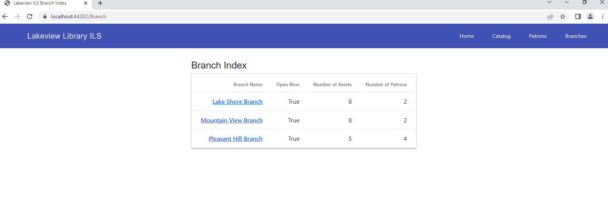
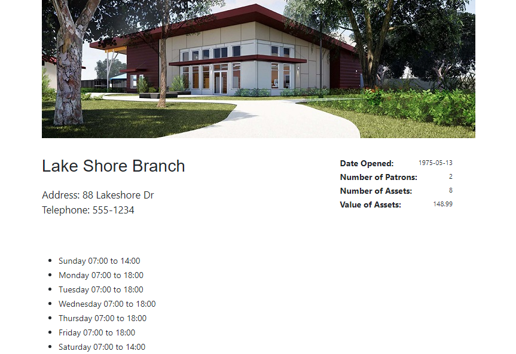

___

# Lightweight Library Management System

A web application for library management.

## Technologies used

- C#/ ASP.NET Core
- Object Oriented Programming
- SQL/ Microsoft SQL Server
- Model-View-Controller (MVC) Design Pattern

  
## Based On

In the making of this project, I followed [Wes Doyle](github.com/wesdoyle)'s great tutorial and customized it a little bit

[Github repository of the original project](https://github.com/wesdoyle/lightlib-lms)

[(Youtube) ASP.NET Core Web Application Tutorial](https://www.youtube.com/watch?v=WTVcLFTgDqs)

## Screen Shots

### Home Page

___

### Library Catalog

___

### Book Detail Page

___

### Patrons

___

### Branches

___

### Branch Detail Page

___